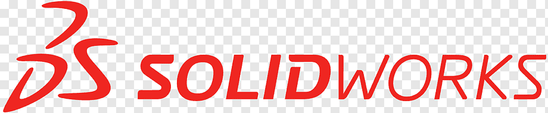
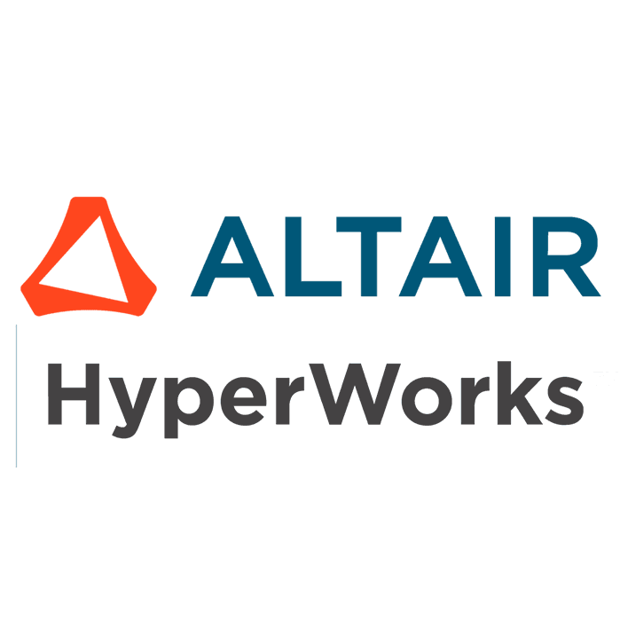

# 👨‍🚀 Dimitris Nentidis (eigenent)

**Mechanical Engineering Student** at the Aristotle University of Thessaloniki  
**Specializing in**: System Identification and Control  
**Experienced with**: Optimization · Finite Element Method · Aerospace Design · Data Analysis 

---

🎓 Currently completing my integrated Master’s thesis:  
**“Active Thermal Control Study on a Biological CubeSat Payload”**

🛰 Past contributor at **[SpaceDot](https://gitlab.com/acubesat)** on the **ACubeSAT** project, where I worked on a wide range of engineering challenges in a cubesat project under the umbrella of **"FYS!3"** of the educational office of the **European Space Agency**.

💡 Interested in:
- System Identification & Control
- Game Theory (Iterated Prisoner’s Dilemma simulations coming soon)
- Cubesats and Aerospace Systems
- Process Optimization
- Scientific Machine Learning 
- Autonomous Systems

## 🧰 Toolbox

  &nbsp;&nbsp;&nbsp;
  &nbsp;&nbsp;&nbsp;
  &nbsp;&nbsp;&nbsp;
  &nbsp;&nbsp;&nbsp;
  &nbsp;&nbsp;&nbsp;
  &nbsp;&nbsp;&nbsp;
  &nbsp;&nbsp;&nbsp;
  

## 📂 Key Repositories (Coming Soon)

- 🔬 **Thesis** – A study on active thermal control for s cubesats' biological payload  
- 🧪 **Mechanical Design** – A guide through a major redesign of AcubeSATs' biological payload 
- 🧠 **Iterated Prisoner’s Dilemma** – Game theory experiments and evolutionary strategies with a twist 

---

## 🔗 Reach out

- 🌐 [LinkedIn](https://www.linkedin.com/in/dimitris-nentidis-151b78254)
- 🧪 [GitLab Profile](https://gitlab.com/diminent)

